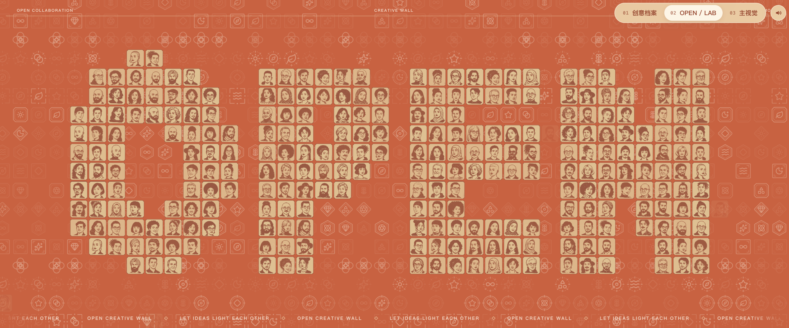
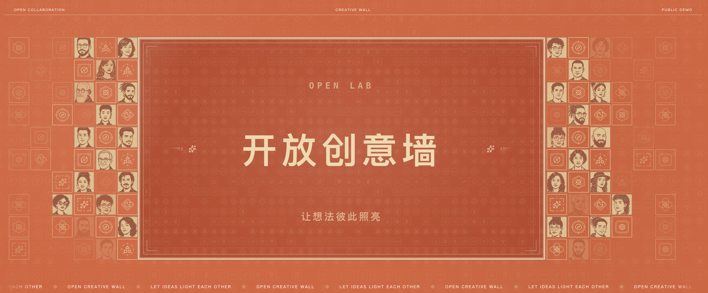

# Open Creative Wall

**开放创意墙**是一个面向活动大屏的开源人物与创意视觉墙，基于 React、Vite 与 WebGL 构建。项目提供人物档案、头像字形和活动主视觉三种场景；仓库中的人物资料均为合成演示数据，不对应员工、参会者或其他真实人物。

本项目以公开模板形式维护。代码与文档采用 MIT License；第三方依赖和视觉素材遵循各自的许可或发布状态，详见 [素材来源清单](ASSET-PROVENANCE.md) 和 [第三方声明](THIRD_PARTY_NOTICES.md)。

[CI](https://github.com/xchangee/open-creative-wall/actions/workflows/ci.yml) · [问题反馈](https://github.com/xchangee/open-creative-wall/issues) · [安全报告](SECURITY.md) · [MIT License](LICENSE)

## 在线预览

[](https://xchangee.github.io/open-creative-wall/)

[](https://xchangee.github.io/open-creative-wall/)

[](https://xchangee.github.io/open-creative-wall/)

[打开在线演示 →](https://xchangee.github.io/open-creative-wall/)

在线演示包含 01 人物档案、02 头像字形与 03 活动主视觉三种场景，并内置经审核的 CC0 循环背景音乐；可点击右上角切换器、音乐按钮，或使用 Q、W、E 键切换。

## 功能

- 01：合成人物档案轮播。
- 02：由虚构头像组成的动态文字序列。
- 03：可配置的活动主视觉。
- Q、W、E 键或页面切换器可在三种场景间切换。
- 内置经来源与哈希审核的 CC0 循环背景音乐，支持播放与暂停。
- 支持 `prefers-reduced-motion` 和 WebGL 初始化失败时的静态降级。
- 可同时生成普通静态站点和 Sites 交付产物。

## 环境要求

- Node.js 22.12.0 或更高版本。
- npm 10.9.0 或更高版本。
- 只有重新生成头像时才需要 [uv](https://docs.astral.sh/uv/) 和可由 uv 获取的 Python 3.13 环境。

日常运行不需要 Python：674 个合成头像 SVG、人物资料和 WebGL atlas 已作为运行时生成物保存在仓库中。

## 快速开始

在项目目录运行：

```bash
npm ci
npm run dev
```

终端会显示本地预览地址。修改界面配置前，先阅读 [定制指南](docs/CUSTOMIZATION.md)。

## 验证与构建

运行完整的本地校验：

```bash
npm run verify
```

也可以按用途分别运行：

```bash
npm run typecheck
npm run check:generated
npm run check:assets
npm run build:client
npm run build
npm run test:sites
npm run preview
```

- `build:client` 生成浏览器静态资源。
- `check:generated` 只读校验人物资料、4 张头像母版、674 个 SVG、生成器和 atlas 是否与 manifest 一致。
- `check:assets` 校验公开素材白名单、来源 manifest、获批音乐的精确哈希，以及禁用的旧品牌/未审核媒体文件。
- `build` 完成类型检查、客户端构建和 Sites 包装。
- `test:sites` 会自行构建并测试 Sites worker；已有构建产物时可使用 `test:sites:built`。
- 完整构建应留下 `dist/client/index.html`、`dist/server/index.js` 和 `dist/.openai/hosting.json`。

部署到子路径时，通过环境变量设置 Vite base，例如：

```bash
VITE_BASE_PATH=/open-creative-wall/ npm run build:client
```

开发服务器监听地址可用 `VITE_HOST` 调整，额外允许的 Host 可通过逗号分隔的 `VITE_ALLOWED_HOSTS` 指定。具体检查项见 [QA 与交付指南](docs/QA-AND-RELEASE.md)。构建只会生成本地产物，不代表获得发布授权，也不会自动部署。

## 合成资料与头像

只重新生成姓名和同行天数：

```bash
npm run generate:profiles -- --seed public-demo-2026
```

用 4 张 8×8、具有明确公开许可的虚构人物母版重建头像：

```bash
npm run generate:avatars
```

同时重建两类数据：

```bash
npm run generate:synthetic
```

头像命令会在预检与暂存验证通过后，替换 674 个 SVG、`public/assets/avatar-atlas.png` 和 `scripts/avatar-output.manifest.json` 中的校验记录。不要手改生成文件，也不要使用真人照片、员工名单、工号或任职记录。完整约束和复现说明见 [合成数据指南](docs/SYNTHETIC-DATA.md)。

## 定制入口

页面标题、三种场景标签、文字序列、活动文案和音乐开关统一从 `src/config/site.ts` 开始修改。渲染结构、布局、颜色、节奏或生成规模等深入改动，请分别参考：

- [架构说明](docs/ARCHITECTURE.md)
- [定制指南](docs/CUSTOMIZATION.md)
- [合成数据指南](docs/SYNTHETIC-DATA.md)
- [QA 与交付指南](docs/QA-AND-RELEASE.md)

本模板以大屏和活动墙为主要目标。调整目标分辨率、头像数量或 atlas 网格属于结构性变更，需要同步修改生成器、渲染器和验证逻辑。

中性纹理、坐标图、记忆符号和 favicon 由锁定的 Lucide 图标与项目生成器产生。修改其生成规则后运行 `npm run generate:textures`，不要直接编辑生成 SVG 或 `scripts/demo-textures.manifest.json`。

## Codex Skill

仓库内置 `.agents/skills/open-creative-wall`。在支持仓库级 Skill 的 Codex 环境中，可以显式调用：

```text
$open-creative-wall 把 03 主视觉改成开放创新论坛，保持其他动效不变，并完成浏览器验收，但不要发布。
```

Skill 只是一层轻量工作流说明；应用源码、生成器和文档仍以本仓库为唯一事实来源。

## 贡献与安全

提交改动前请阅读 [贡献指南](CONTRIBUTING.md) 和 [行为准则](CODE_OF_CONDUCT.md)。安全问题不要提交公开 Issue，请按 [安全政策](SECURITY.md) 私下报告。

## 许可

软件源码和项目文档采用 [MIT License](LICENSE)。这不会自动授予任何第三方字体、商标、音乐、人物肖像或其他素材的权利；公开 fork 前必须逐项遵守 [ASSET-PROVENANCE.md](ASSET-PROVENANCE.md) 中的状态和要求。

`package.json` 保持 `private: true`，用于防止误发布到 npm；它不改变仓库中已经声明的开源许可。
